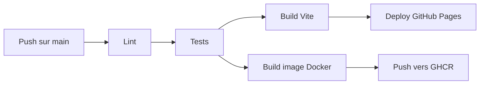

# World Cup Quiz 2026

Un mini-jeu mobile de quiz sur la Coupe du Monde, inspiré de Block Blast.

**[Jouer en ligne](https://boupdown.github.io/World-Cup-Game/)**

[](https://github.com/BOupdown/World-Cup-Game/actions/workflows/deploy.yml)


<!--  -->

## Le concept

Un quiz football en mode survie : plus tu réponds vite, plus tu marques de points.
Les bonnes réponses enchaînées activent des multiplicateurs (x2 à partir de 3, x3 à partir de 6).
Une seule erreur ou un chrono à zéro et la partie est finie. Le meilleur score est sauvegardé.

Tout est pensé mobile-first : pas de bouton "question suivante", les questions s'enchaînent
automatiquement avec vibrations, sons et animations.

## Fonctionnalités

- Mode survie infini, les questions se recyclent sans limite
- Score de vitesse : timer de 10s par question
- Multiplicateurs de série
- Meilleur score persistant (localStorage)
- Bande-son entièrement générée avec le Web Audio API : aucun fichier audio,
  la musique de fond et les effets sont synthétisés note par note
- Mode "Apprendre" : fiches sur les 23 éditions de la Coupe du Monde (1930 à 2026)
- Vibrations sur mobile (API Vibration)
- Drapeaux affichés en vraies images SVG (les emojis drapeaux ne s'affichent pas sous Windows)

## Stack

| Outil | Usage |
|-------|-------|
| React 18 + Vite | UI |
| Framer Motion | Animations et transitions |
| Web Audio API | Synthèse audio temps réel |
| Vitest | Tests unitaires |
| ESLint | Lint, exécuté dans la CI |
| Docker + nginx | Image de production multi-stage, publiée sur GHCR |
| GitHub Actions | CI/CD |

## Pipeline CI/CD

Chaque push sur `main` déclenche :



Le lint et les tests font office de quality gate : en cas d'échec, rien n'est déployé.
L'image Docker est taguée `latest` + SHA du commit et poussée sur GitHub Container Registry.

## Lancer en local

```bash
git clone https://github.com/BOupdown/World-Cup-Game.git
cd World-Cup-Game
npm install
npm run dev        # serveur de dev
npm test           # tests unitaires
npm run lint       # analyse statique
```

## Lancer avec Docker

```bash
# depuis l'image publiée
docker run -p 8080:80 ghcr.io/boupdown/world-cup-game:latest

# ou en local
docker compose up --build
```

Puis ouvrir http://localhost:8080.

## Architecture

```
src/
├── App.jsx                  # navigation entre écrans + état global
├── screens/
│   ├── HomeScreen.jsx       # accueil (trophée SVG, options)
│   ├── GameScreen.jsx       # gameplay (timer, score, multiplicateurs)
│   ├── GameOverScreen.jsx   # score final, record
│   └── LearnScreen.jsx      # fiches des 23 éditions
├── components/              # drapeaux, particules, barres de progression
├── hooks/
│   ├── useSound.js          # moteur audio Web Audio API
│   └── useHaptic.js         # vibrations mobile
├── utils/
│   └── score.js             # règles de scoring (testées)
└── data/                    # questions + données des Coupes du Monde
```

---

Développé par [Omar Benzeroual](https://www.linkedin.com/in/omar-benzeroual-50898921b/)
